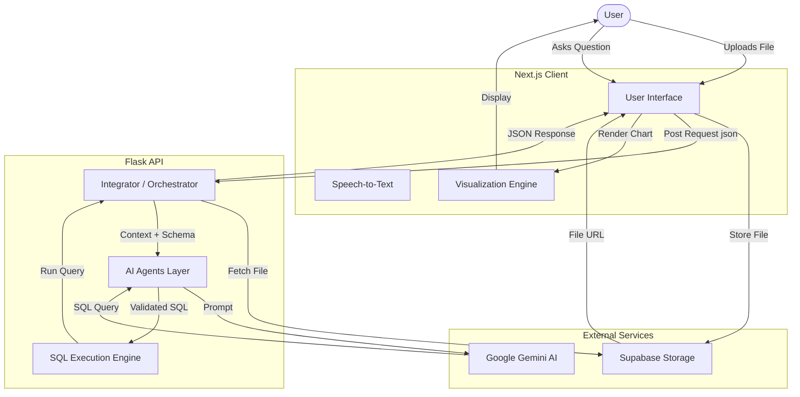

# Hynox Voice - End-to-End Product Documentation

**Version:** 1.0.0
**Last Updated:** December 2025

Welcome to the comprehensive developer documentation for **Hynox Voice**. This guide covers the architecture, setup, code structure, and development workflow for the product.

---

## 1. Product Overview

**Hynox Voice** is an AI-powered conversational analytics platform. It allows users to upload datasets (CSV, Excel) and "chat" with their data using natural language. The system automatically converts questions into SQL queries, executes them against the data, and returns both textual summaries and interactive visualizations.

### Key Features
- **Natural Language to SQL**: Uses Google Gemini to understand complex questions.
- **Dynamic Visualization**: Automatically generates charts based on query results.
- **Voice Interaction**: Supports speech-to-text for queries and text-to-speech for responses.
- **Hybrid Execution Engine**: Uses `pandasql` and `DuckDB` for robust data querying.

---

## 2. Architecture & Data Flow

The application follows a **Decoupled Client-Server Architecture**.

### High-Level Architecture Diagram



### Detailed Component Roles

1.  **Frontend (`hynox-voice`)**
    *   **Framework**: Next.js 14 (React, TypeScript).
    *   **Role**: Handles user interaction, manages voice recording (Web Speech API), stores file headers in `localStorage`, and renders Recharts visualizations.
    *   **Storage**: Uses Supabase for temporary file hosting to generate accessible URLs for the backend.

2.  **Backend (`Hynox-Voice-Flask`)**
    *   **Framework**: Flask (Python).
    *   **Role**: State-less query processor. It does not "re-train" on data; it ingests the dataset on-the-fly for every session to ensure privacy and freshness.
    *   **Engine**:
        1.  **Ingestion**: Reads CSV/Excel from URL into a Pandas DataFrame.
        2.  **Reasoning**: Uses `UserQueryCheckAgent` to verify intent and `SQLGeneratorAgent` to write code.
        3.  **Execution**: Tries `pandasql` (SQLite syntax) first. If it fails or returns empty, it falls back to `DuckDB` for advanced analytical queries.

---

## 3. Setup & Installation

### Prerequisites
- **Node.js** (v18+) & **npm/yarn**
- **Python** (v3.10+)
- **Supabase Account** (for file storage)
- **Google Gemini API Key**

### A. Backend Setup (`Hynox-Voice-Flask`)

1.  **Navigate to directory**:
    ```bash
    cd Hynox-Voice-Flask
    ```

2.  **Create Virtual Environment** (Recommended):
    ```bash
    python -m venv .venv
    # Windows
    .venv\Scripts\activate
    # Mac/Linux
    source .venv/bin/activate
    ```

3.  **Install Dependencies**:
    ```bash
    pip install -r requirements.txt
    ```

4.  **Environment Configuration**:
    Create a `.env` file in `Hynox-Voice-Flask/`:
    ```ini
    # Key Rotation Support (Add up to 10 keys)
    GEMINI_API_KEY_1=your_google_gemini_key_here
    
    FLASK_DEBUG=True
    FLASK_PORT=5000
    ```

5.  **Run Server**:
    ```bash
    python backend.py
    ```

### B. Frontend Setup (`hynox-voice`)

1.  **Navigate to directory**:
    ```bash
    cd hynox-voice
    ```

2.  **Install Dependencies**:
    ```bash
    npm install
    ```

3.  **Environment Configuration**:
    Create a `.env.local` file in `hynox-voice/`:
    ```ini
    # Connection to Python Backend
    NEXT_PUBLIC_FLASK_API_URL=http://localhost:5000

    # Supabase (For File Uploads)
    NEXT_PUBLIC_SUPABASE_URL=your_supabase_project_url
    NEXT_PUBLIC_SUPABASE_ANON_KEY=your_supabase_anon_key
    ```

4.  **Run Development Server**:
    ```bash
    npm run dev
    ```

---

## 4. Codebase Walkthrough

### Backend Structure

| File | Description |
| :--- | :--- |
| **`backend.py`** | Entry point. Exposes `/backend` endpoint. |
| **`integrate.py`** | Main logic controller. Orchestrates fetching data, calling AI, and formatting output. |
| **`query_processing.py`** | Contains the AI Agents classes (`UserQueryCheckAgent`, `SQLGeneratorAgent`). |
| **`process_sql.py`** | Handles safe execution of SQL against DataFrames using `pandasql` and `duckdb`. |

### Frontend Structure

| File | Description |
| :--- | :--- |
| **`app/chat/page.tsx`** | The React "Brain". Manages connection state, chat history, and API calls. |
| **`components/chat/response-card.tsx`** | Determines how to display results (Line Chart, Bar Chart, or Plain Text). |
| **`components/chat/voice-visualizer.tsx`** | Canvas-based audio frequency visualizer for the microphone input. |

---

## 5. Development Guide

### Adding a New Chart Type
To add a new visualization (e.g., Radar Chart):

1.  **Backend**: Update `visualization.py` to identify data shapes suitable for Radar charts (multivariate data). Return `type: "radar"` in the JSON.
2.  **Frontend**: 
    *   Open `components/chat/response-card.tsx`.
    *   Import `RadarChart` from `recharts`.
    *   Add a conditional block: `if (data.type === 'radar') return <RadarChart ... />`.

### Deployment Checklist
1.  **Production WSGI**: Use `gunicorn` instead of `python backend.py` for the Flask app.
    ```bash
    gunicorn -w 4 -b 0.0.0.0:5000 backend:app
    ```
2.  **CORS**: Ensure `API_config.py` allows the domain where the Frontend is hosted.
3.  **Environment Variables**: Never commit `.env` files. Set them in your hosting provider's dashboard (Vercel/Render).
